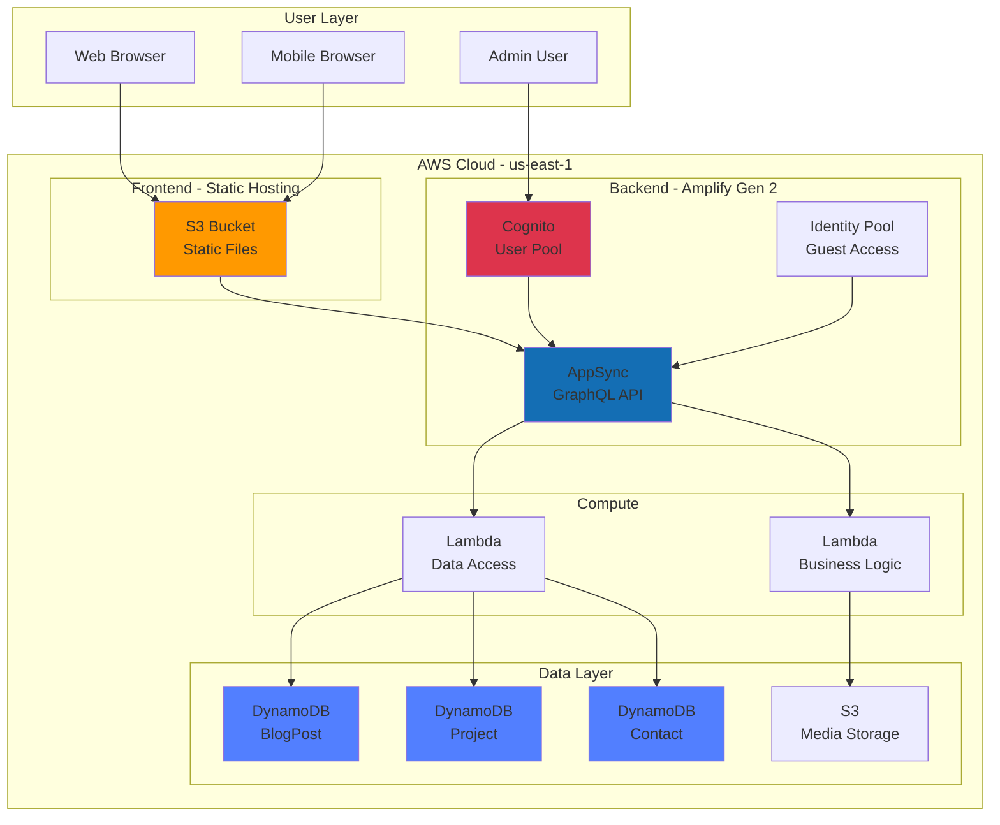
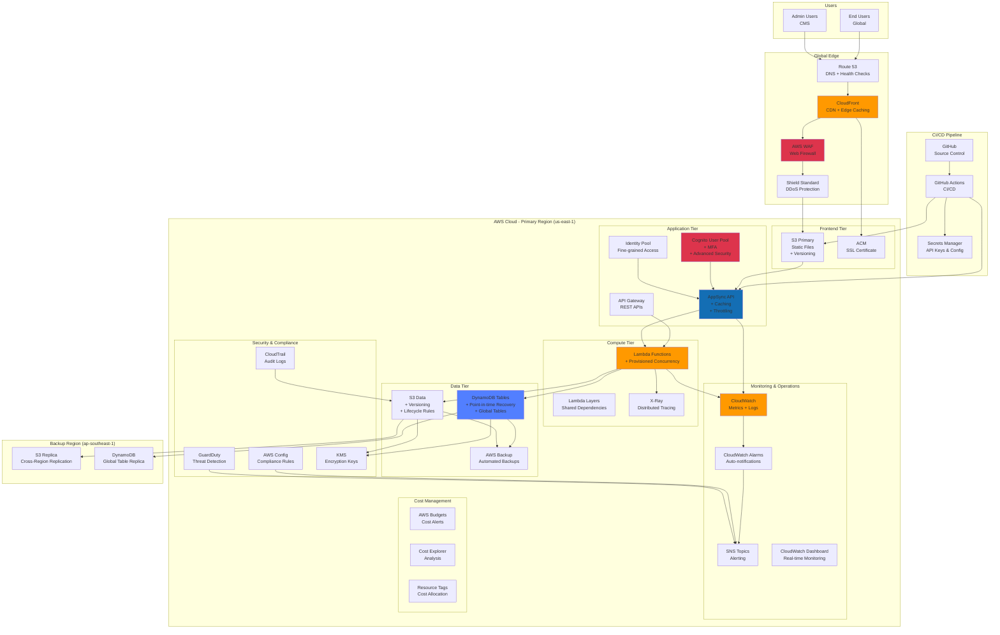
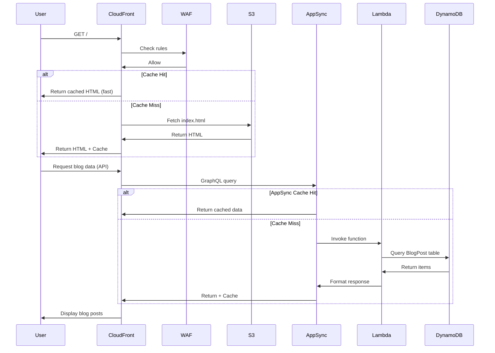
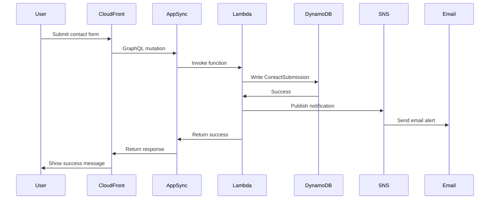
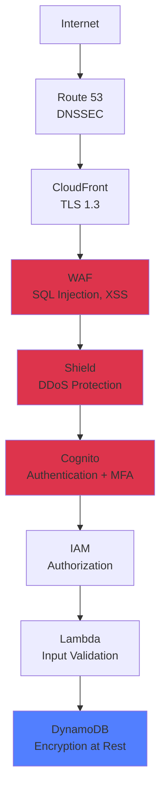
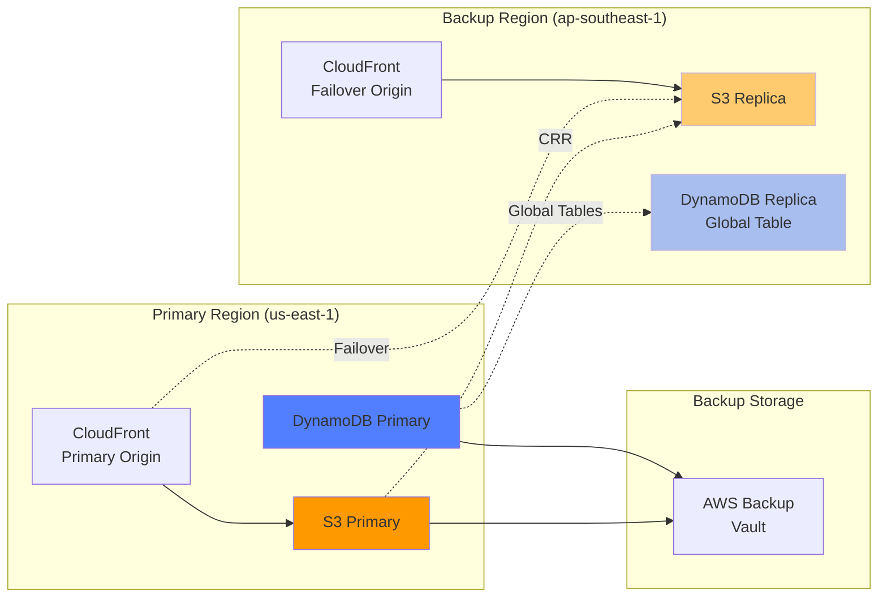
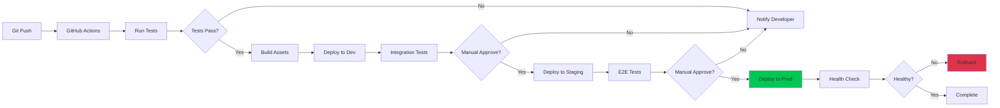

# Portfolio Architecture - AWS Solutions Architect Grade

## 📋 Table of Contents
1. [Architecture Overview](#architecture-overview)
2. [Current State Architecture](#current-state-architecture)
3. [Target State Architecture](#target-state-architecture)
4. [Well-Architected Framework](#well-architected-framework)
5. [Component Details](#component-details)
6. [Data Flow](#data-flow)
7. [Security Architecture](#security-architecture)
8. [Disaster Recovery](#disaster-recovery)

---

## 🏗️ Architecture Overview

This portfolio demonstrates AWS Solutions Architect best practices including:

- **Multi-tier architecture** with frontend, API, and data layers
- **High availability** across multiple AZs
- **Security in depth** with WAF, Cognito, and encryption
- **Performance optimization** with CloudFront CDN and caching
- **Cost optimization** with serverless and right-sizing
- **Operational excellence** with CI/CD and monitoring
- **Infrastructure as Code** with AWS CDK

---

## 📊 Current State Architecture



**Current State Limitations:**
- ❌ No CDN (slow global access)
- ❌ No WAF protection
- ❌ Single region deployment
- ❌ No monitoring/alerting
- ❌ Manual deployment
- ❌ No backup strategy

---

## 🎯 Target State Architecture (SA Grade)



---

## 🛡️ Well-Architected Framework Compliance

### 1. Operational Excellence

**Design Principles:**
- ✅ **Infrastructure as Code**: AWS CDK for all resources
- ✅ **CI/CD Pipeline**: GitHub Actions for automated deployment
- ✅ **Monitoring**: CloudWatch dashboards and alarms
- ✅ **Runbooks**: Documented procedures for common operations

**Implementation:**
```typescript
// CDK Stack for complete infrastructure
const stack = new PortfolioStack(app, 'PortfolioStack', {
  env: {
    account: process.env.CDK_DEFAULT_ACCOUNT,
    region: 'us-east-1'
  },
  tags: {
    Environment: 'production',
    Project: 'Portfolio',
    ManagedBy: 'CDK',
    CostCenter: 'Engineering'
  }
});
```

### 2. Security

**Design Principles:**
- ✅ **Identity & Access**: Cognito with MFA, fine-grained IAM roles
- ✅ **Detection**: CloudTrail, Config, GuardDuty
- ✅ **Infrastructure Protection**: WAF, Shield, Security Groups
- ✅ **Data Protection**: Encryption at rest (KMS) and in transit (TLS 1.3)
- ✅ **Incident Response**: SNS alerts, automated remediation

**Security Layers:**
```
Layer 1: WAF + Shield (DDoS, SQL injection, XSS)
Layer 2: CloudFront (Edge security, geo-blocking)
Layer 3: Cognito (Authentication + MFA)
Layer 4: IAM (Fine-grained permissions)
Layer 5: KMS (Encryption at rest)
Layer 6: TLS 1.3 (Encryption in transit)
Layer 7: CloudTrail (Audit logging)
```

### 3. Reliability

**Design Principles:**
- ✅ **Multi-AZ**: DynamoDB and Lambda across AZs
- ✅ **Backup**: Automated daily backups with 30-day retention
- ✅ **Disaster Recovery**: Cross-region replication (RTO: 1h, RPO: 15min)
- ✅ **Auto-healing**: Lambda retries, DynamoDB auto-scaling
- ✅ **Testing**: Automated testing in CI/CD pipeline

**Availability Targets:**
- Frontend (CloudFront): 99.99% SLA
- API (AppSync): 99.95% SLA
- Database (DynamoDB): 99.99% SLA
- **Overall Target**: 99.9% (8.76 hours downtime/year)

### 4. Performance Efficiency

**Design Principles:**
- ✅ **Serverless**: Lambda, AppSync (auto-scaling)
- ✅ **Caching**: CloudFront edge (TTL: 24h), AppSync (TTL: 1h)
- ✅ **Global Distribution**: CloudFront 400+ edge locations
- ✅ **Monitoring**: CloudWatch performance metrics
- ✅ **Right-sizing**: On-demand capacity for Lambda and DynamoDB

**Performance Targets:**
- Page Load: < 2s (global average)
- API Response: < 200ms (p99)
- Time to First Byte: < 100ms (CloudFront)
- Database Queries: < 10ms (DynamoDB)

### 5. Cost Optimization

**Design Principles:**
- ✅ **Serverless**: Pay per use (no idle costs)
- ✅ **On-demand**: Lambda and DynamoDB on-demand pricing
- ✅ **Lifecycle Policies**: S3 Intelligent-Tiering for old assets
- ✅ **Budgets**: Monthly budget alerts
- ✅ **Tagging**: Cost allocation by environment and service

**Cost Estimates:**
| Service | Monthly Cost | Notes |
|---------|-------------|-------|
| CloudFront | $1-5 | Based on traffic |
| S3 | $0.50-2 | Storage + requests |
| DynamoDB | $0-1 | Free tier eligible |
| Lambda | $0-1 | Free tier eligible |
| AppSync | $0-2 | Free tier eligible |
| WAF | $5-10 | Base + rules |
| Route 53 | $1 | Hosted zone + queries |
| **Total** | **$7.50-22/month** | Low-medium traffic |

### 6. Sustainability

**Design Principles:**
- ✅ **Serverless**: Optimal resource utilization
- ✅ **Edge Caching**: Reduced origin requests
- ✅ **Right-sizing**: No over-provisioning
- ✅ **Region Selection**: us-east-1 (renewable energy)

---

## 🔧 Component Details

### Frontend Tier

**S3 Static Hosting:**
```json
{
  "versioning": "enabled",
  "encryption": "AES-256",
  "lifecycleRules": [
    {
      "prefix": "old-assets/",
      "transition": {
        "days": 90,
        "storageClass": "GLACIER"
      }
    }
  ],
  "cors": {
    "allowedOrigins": ["https://yourdomain.com"],
    "allowedMethods": ["GET", "HEAD"],
    "maxAge": 3600
  }
}
```

**CloudFront Distribution:**
```json
{
  "priceClass": "PriceClass_All",
  "geoRestriction": "none",
  "originProtocol": "https-only",
  "viewerProtocol": "redirect-to-https",
  "compress": true,
  "defaultCacheBehavior": {
    "ttl": 86400,
    "minTTL": 0,
    "maxTTL": 31536000,
    "forwardQueryStrings": false,
    "forwardCookies": "none"
  },
  "customErrorResponses": [
    {
      "errorCode": 404,
      "responseCode": 200,
      "responsePage": "/index.html"
    }
  ]
}
```

### Application Tier

**AppSync API Configuration:**
```json
{
  "authenticationType": "AMAZON_COGNITO_USER_POOLS",
  "additionalAuthTypes": [
    "AWS_IAM",
    "API_KEY"
  ],
  "cachingBehavior": {
    "ttl": 3600,
    "atRestEncryption": true,
    "transitEncryption": true
  },
  "xrayEnabled": true,
  "logConfig": {
    "cloudWatchLogsRoleArn": "arn:aws:iam::...",
    "excludeVerboseContent": false,
    "fieldLogLevel": "ERROR"
  }
}
```

**Lambda Configuration:**
```json
{
  "runtime": "nodejs20.x",
  "memorySize": 1024,
  "timeout": 30,
  "reservedConcurrentExecutions": 100,
  "environment": {
    "NODE_ENV": "production",
    "LOG_LEVEL": "info",
    "POWERTOOLS_SERVICE_NAME": "portfolio"
  },
  "tracing": "Active",
  "layers": [
    "arn:aws:lambda:us-east-1:...:layer:AWSLambdaPowertoolsTypeScript"
  ]
}
```

### Data Tier

**DynamoDB Configuration:**
```json
{
  "billingMode": "PAY_PER_REQUEST",
  "pointInTimeRecovery": true,
  "encryption": {
    "type": "KMS",
    "kmsKeyId": "arn:aws:kms:us-east-1:..."
  },
  "streamEnabled": true,
  "globalSecondaryIndexes": [
    {
      "indexName": "CategoryIndex",
      "keys": ["category", "publishedAt"],
      "projectionType": "ALL"
    }
  ],
  "timeToLive": {
    "enabled": true,
    "attributeName": "expiresAt"
  }
}
```

---

## 🔄 Data Flow

### Read Path (Blog Post)



### Write Path (Contact Form)



---

## 🔐 Security Architecture

### Defense in Depth



### WAF Rules

1. **Rate Limiting**: 2000 requests per 5 minutes per IP
2. **Geo Blocking**: Block high-risk countries (optional)
3. **SQL Injection**: AWS Managed Rules
4. **XSS Protection**: AWS Managed Rules
5. **Known Bad Inputs**: AWS Managed Rules
6. **Bot Control**: Challenge suspicious bots

### IAM Policies

**Lambda Execution Role:**
```json
{
  "Version": "2012-10-17",
  "Statement": [
    {
      "Effect": "Allow",
      "Action": [
        "dynamodb:GetItem",
        "dynamodb:Query",
        "dynamodb:Scan"
      ],
      "Resource": "arn:aws:dynamodb:us-east-1:*:table/BlogPost*",
      "Condition": {
        "StringEquals": {
          "aws:RequestedRegion": "us-east-1"
        }
      }
    },
    {
      "Effect": "Allow",
      "Action": [
        "logs:CreateLogGroup",
        "logs:CreateLogStream",
        "logs:PutLogEvents"
      ],
      "Resource": "arn:aws:logs:*:*:*"
    }
  ]
}
```

---

## 🚨 Disaster Recovery

### Strategy: Warm Standby

**Recovery Objectives:**
- **RTO (Recovery Time Objective)**: 1 hour
- **RPO (Recovery Point Objective)**: 15 minutes

### Implementation



### Backup Schedule

| Resource | Frequency | Retention | Method |
|----------|-----------|-----------|--------|
| DynamoDB | Continuous | 30 days | Point-in-time recovery |
| S3 Assets | Real-time | Versioning | Cross-region replication |
| Lambda Code | On deploy | Indefinite | S3 versioning |
| Config | Daily | 90 days | AWS Backup |

### Failover Procedure

1. **Detection** (Auto): CloudWatch alarm detects region failure
2. **Notification** (< 5 min): SNS alerts on-call engineer
3. **Assessment** (5-15 min): Verify scope of failure
4. **Activation** (15-30 min): Update Route 53 to backup region
5. **Verification** (30-45 min): Test all functionality
6. **Communication** (45-60 min): Update status page

---

## 📊 Monitoring & Alerting

### CloudWatch Dashboard

**Widgets:**
1. API Request Count (AppSync)
2. Lambda Invocations & Errors
3. DynamoDB Read/Write Capacity
4. CloudFront Cache Hit Ratio
5. WAF Blocked Requests
6. Estimated Monthly Cost

### Alarms

| Metric | Threshold | Action |
|--------|-----------|--------|
| API Error Rate | > 1% | SNS alert |
| Lambda Duration | > 25s | SNS alert |
| DynamoDB Throttles | > 0 | Auto-scale + alert |
| CloudFront 5xx | > 5% | SNS alert + failover |
| Monthly Cost | > $50 | SNS alert |
| Failed Logins | > 10/min | SNS alert + block IP |

---

## 🎯 Performance Optimization

### Caching Strategy

```
Level 1: Browser Cache (7 days)
  ├─ Static assets: CSS, JS, images
  └─ Control: Cache-Control headers

Level 2: CloudFront Edge (24 hours)
  ├─ HTML pages
  ├─ API responses (public data)
  └─ Control: TTL settings

Level 3: AppSync Cache (1 hour)
  ├─ GraphQL queries
  └─ Control: Caching resolver

Level 4: Lambda Memory (warm start)
  ├─ Database connections
  ├─ SDK clients
  └─ Control: Provisioned concurrency
```

### Image Optimization

```bash
# Automatic optimization with CloudFront Functions
function handler(event) {
    var request = event.request;
    var uri = request.uri;

    // WebP support
    if (request.headers.accept &&
        request.headers.accept.value.includes('image/webp')) {
        uri = uri.replace(/\.(jpg|png)$/, '.webp');
    }

    // Responsive images
    var width = request.headers['cloudfront-viewer-width'];
    if (width && width.value < 640) {
        uri = uri.replace('/images/', '/images/mobile/');
    }

    request.uri = uri;
    return request;
}
```

---

## 📝 Compliance & Governance

### AWS Config Rules

- ✅ S3 bucket encryption enabled
- ✅ CloudTrail enabled in all regions
- ✅ IAM password policy compliance
- ✅ DynamoDB point-in-time recovery enabled
- ✅ Lambda functions in VPC (if needed)
- ✅ Security groups no unrestricted access

### Tagging Strategy

**Required Tags:**
```json
{
  "Environment": "production|staging|development",
  "Project": "Portfolio",
  "Owner": "kha.van.hoang@email.com",
  "CostCenter": "Engineering",
  "ManagedBy": "CDK",
  "BackupPolicy": "daily|weekly|none",
  "Compliance": "none|pci|hipaa"
}
```

---

## 🚀 Deployment Architecture

### Multi-Environment Strategy

```
Production (prod)
├─ us-east-1 (primary)
└─ ap-southeast-1 (backup)

Staging (staging)
└─ us-east-1

Development (dev)
└─ Local + us-east-1
```

### CI/CD Pipeline



---

## 📚 Additional Resources

- [AWS Well-Architected Framework](https://aws.amazon.com/architecture/well-architected/)
- [AWS Solutions Library](https://aws.amazon.com/solutions/)
- [AWS Architecture Center](https://aws.amazon.com/architecture/)
- [CDK Best Practices](https://docs.aws.amazon.com/cdk/latest/guide/best-practices.html)

---

**Document Version:** 1.0.0
**Last Updated:** 2025-11-08
**Maintained By:** AWS Solutions Architect Team
**Review Cycle:** Quarterly

🤖 Generated with Claude Code
